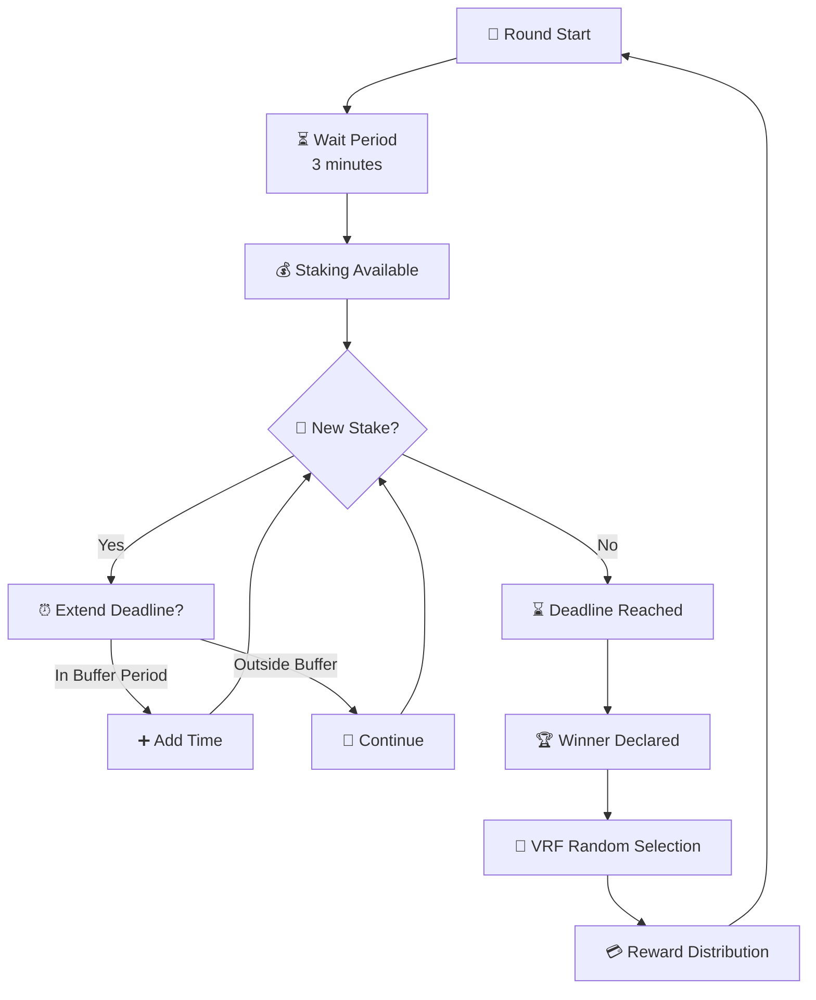

# 🎯 Last Staker Wins (LSW) - Somnia Testnet

[](https://nextjs.org/)
[](https://somnia.network/)
[](https://soliditylang.org/)

## 🚀 Hackathon Submission Overview

**Last Staker Wins** is a competitive blockchain game built for **Somnia Testnet** where players stake STT tokens to become the last staker before the round deadline. The game combines strategy, timing, and luck with fair reward distribution powered by Chainlink VRF.

### 🎮 What Makes This Special

- **Strategic Timing**: Late stakes extend the round deadline, creating intense final moments
- **Fair Distribution**: 70% to winner, 20% to random participants, 10% to treasury
- **Real-time Updates**: Live activity feed shows all stakes and round completions
- **Mobile Optimized**: Responsive design works perfectly on all devices
- **Provably Fair**: Chainlink VRF ensures transparent random selection

### 🏆 Key Achievements

- ✅ **Full-Stack Implementation**: Smart contracts + modern web frontend
- ✅ **Somnia Integration**: Native STT token support with 18-decimal precision
- ✅ **Real-time Experience**: Live updates without page refresh
- ✅ **Admin Dashboard**: Complete game management interface
- ✅ **Security First**: Comprehensive access controls and validation

## 🎯 Demo & Live Application

**🌐 Live Demo**: [Deploy URL Coming Soon]  
**📱 Try it Now**: Connect your wallet and play on Somnia Testnet  
**🔗 Contracts**: View verified contracts on Somnia Explorer  

### 📸 Screenshots

  
*Main game interface with real-time updates*

---

## 🏗️ Architecture Overview

### 🖥️ Frontend Stack
- **Next.js 16** with App Router (Latest features)
- **TypeScript** for type safety
- **Tailwind CSS** + shadcn/ui for modern design
- **Wagmi v2 + Viem** for blockchain interactions
- **Real-time Events** using WebSocket-like contract listening

### ⛓️ Smart Contract Architecture

The system consists of two main contracts deployed on **Somnia Testnet**:

#### 1. 🎮 LSW Contract (`LSW.sol`)
**Address**: `0xab20...` (Somnia Testnet)
- Round management and timing logic
- STT token stake collection (18 decimals)
- Winner determination
- Administrative controls
- Emergency functions

#### 2. 🎲 Rewarder Contract (`rewarder.sol`)  
**Address**: `0xEa9C...` (Somnia Testnet)
- Chainlink VRF integration for fairness
- Random participant selection (when >10 players)
- Automated reward distribution
- Treasury management

## 🎮 How The Game Works

### 🔄 Complete Game Flow



### 📋 Detailed Mechanics

1. **🚀 Round Initialization**
   - New round starts automatically or by winner/admin
   - Fixed duration: 1 hour default
   - Prize pool starts at zero

2. **⏰ Staking Wait Period**  
   - **3-minute cooldown** after round start
   - Prevents immediate staking rushes
   - UI shows countdown until staking available

3. **💰 Active Staking Phase**
   - Minimum stake: **0.01 STT tokens**
   - Each stake makes you the potential winner
   - **Smart deadline extension**: Stakes within 10 minutes of deadline add extra time

4. **🏁 Round Completion**
   - Automatic end when deadline passes
   - Last staker becomes the winner
   - All stakes locked until distribution

5. **🎁 Reward Distribution**
   - **70%** → Winner (guaranteed)
   - **20%** → Random participants (via Chainlink VRF)
   - **10%** → Platform treasury
   - Automatic distribution with transparent random selection

6. **🔄 Next Round**
   - Winner or admin can start next round
   - Fresh 3-minute wait period begins
   - Previous round history preserved

---

## ✨ Key Features & Innovation

### 🎯 Frontend Innovation
- **🔴 Real-time Activity Feed**: Live stake notifications and round completions
- **📊 Round History**: Complete historical data with winner information  
- **👥 Multi-wallet Support**: MetaMask, WalletConnect, and more
- **📱 Mobile-First Design**: Perfect experience on any device
- **⚡ Instant Updates**: No refresh needed, everything updates live
- **🎨 Modern UI**: Clean, intuitive interface with smooth animations

### ⛓️ Smart Contract Innovation
- **🎲 Provably Fair Randomness**: Chainlink VRF integration
- **⏰ Dynamic Timing**: Smart deadline extensions for exciting finishes  
- **🛡️ Security First**: Comprehensive access controls and validations
- **💎 Gas Optimized**: Efficient storage and minimal transaction costs
- **🔧 Configurable**: Admin can adjust timing and stake parameters
- **🚨 Emergency Controls**: Safe withdrawal and pause mechanisms

### 🌟 Somnia-Specific Features
- **🪙 Native STT Integration**: Full 18-decimal precision support
- **🚀 Optimized for Somnia**: Leveraging network's high performance
- **🔗 Block Explorer Integration**: Full transaction transparency
- **⚡ Fast Confirmation**: Quick transaction processing

---

## 🚀 Quick Start Guide

### 🎮 For Players

1. **🔗 Connect Wallet**: Use MetaMask or any Web3 wallet
2. **🌐 Switch Network**: Connect to Somnia Testnet
3. **💰 Get STT Tokens**: Use Somnia Testnet faucet
4. **🎯 Start Playing**: Wait for staking to become available, then stake!

### 👨‍💻 For Developers

#### Prerequisites
- Node.js 18+
- Git
- Web3 wallet for testing

#### 🏃‍♂️ Local Development

```bash
# Clone the repository
git clone https://github.com/Skinny001/LSW-Somnia.git
cd LSW-Somnia

# Install dependencies
npm install

# Set up environment
cp .env.example .env.local
# Add your wallet and contract addresses

# Run development server
npm run dev

# Build for production
npm run build
```

#### 🌐 Environment Variables

```env
# Required for local development
NEXT_PUBLIC_WALLETCONNECT_PROJECT_ID=your_project_id

# Somnia Testnet Contract Addresses
NEXT_PUBLIC_LSW_CONTRACT_ADDRESS=0xab20...
NEXT_PUBLIC_REWARDER_CONTRACT_ADDRESS=0xEa9C...
NEXT_PUBLIC_TREASURY_ADDRESS=0x1289...

# Development Admin Access
NEXT_PUBLIC_DEV_ADMIN_ADDRESSES=0x372b...
```

---

## 🏆 Technical Highlights

### 🎯 Frontend Architecture

```typescript
// Real-time event listening example
const watchRoundEndedEvents = async (callback: Function) => {
  return publicClient.watchContractEvent({
    address: LSW_CONTRACT_ADDRESS,
    abi: LSW_ABI,
    eventName: 'RoundEnded',
    onLogs: (logs) => {
      logs.forEach((log) => {
        const { roundId, winner, totalAmount } = log.args
        callback(roundId, winner, totalAmount)
      })
    }
  })
}
```

### ⛓️ Smart Contract Highlights

```solidity
// Dynamic deadline extension logic
if (block.timestamp >= currentRound.deadline - bufferDelay) {
    currentRound.deadline = block.timestamp + stakeBuffer;
    emit StakeReceived(currentRoundId, msg.sender, msg.value, currentRound.deadline);
}
```

### 🔄 State Management

- **React Hooks**: Custom hooks for contract interactions
- **Real-time Updates**: Event-driven UI updates
- **Wagmi Integration**: Type-safe blockchain interactions
- **Error Handling**: Comprehensive error states and recovery

### 🎨 UI/UX Features

- **Responsive Design**: Mobile-first approach with Tailwind CSS
- **Loading States**: Smooth loading animations and skeleton screens
- **Real-time Feedback**: Instant visual feedback for all actions
- **Accessibility**: WCAG compliant with proper ARIA labels
- **Dark Mode Ready**: Theme system ready for expansion

## Testing

The project includes comprehensive tests covering:

### Unit Tests
- **LSW.t.sol**: Tests for the main LSW contract
- **Rewarder.t.sol**: Tests for the Rewarder contract
- **Integration.t.sol**: End-to-end integration tests

### Test Coverage
- Round lifecycle management
- Staking mechanics and validation
- Timing and deadline extensions
- Reward distribution logic
- VRF integration and fallbacks
- Access control and permissions
- Edge cases and error conditions

### Running Tests

```bash
# Run all tests
forge test

# Run tests with verbose output
forge test -vvv

# Run specific test file
forge test --match-path test/LSW.t.sol

# Run with gas reporting
forge test --gas-report

# Generate coverage report
forge coverage
```

## Network Configuration

## Base Sepolia
- VRF Coordinator: `0x5C210eF41CD1a72de73bF76eC39637bB0d3d7BEE`
- Key Hash (500 gwei): `0x9e1344a1247c8a1785d0a4681a27152bffdb43666ae5bf7d14d24a5efd44bf71`

### Polygon Mainnet
- VRF Coordinator: `0xAE975071Be8F8eE67addBC1A82488F1C24858067`
- Key Hash (500 gwei): `0xcc294a196eeeb44da2888d17c0625cc88d70d9760a69d58d853ba6581a9ab0cd`

### Polygon Mumbai Testnet
- VRF Coordinator: `0x7a1BaC17Ccc5b313516C5E16fb24f7659aA5ebed`
- Key Hash (500 gwei): `0x4b09e658ed251bcafeebbc69400383d49f344ace09b9576fe248bb02c003fe9f`

### Ethereum Mainnet
- VRF Coordinator: `0x271682DEB8C4E0901D1a1550aD2e64D568E69909`
- Key Hash (500 gwei): `0x8af398995b04c28e9951adb9721ef74c74f93e6a478f39e7e0777be13527e7ef`

## API Reference

### LSW Contract

#### Main Functions
- `stake()`: Participate in the current round (after wait period)
- `startNewRound()`: Start a new round (winner or owner only)
- `getCurrentRoundInfo()`: Get current round information including staking availability
- `getTimeRemaining()`: Get time remaining in current round
- `getTimeUntilStakingAvailable()`: Get time until staking becomes available
- `isStakingAvailable()`: Check if staking is currently allowed

#### Admin Functions
- `setRewarderContract(address)`: Set the rewarder contract
- `setTreasury(address)`: Update treasury address
- `updateStakeAmount(uint256)`: Update minimum stake amount
- `updateBufferSettings(uint256, uint256)`: Update timing parameters
- `updateStakingWaitPeriod(uint256)`: Update staking wait period
- `emergencyWithdraw()`: Emergency withdrawal (owner only)

### Rewarder Contract

#### Main Functions
- `rewardRandomParticipants()`: Distribute rewards (LSW contract only)
- `manualDistribution(uint256)`: Manual reward distribution (owner only)

#### Admin Functions
- `updateLSWContract(address)`: Update LSW contract address
- `updateVRFConfig()`: Update Chainlink VRF configuration
- `emergencyWithdraw()`: Emergency withdrawal (owner only)

## Events

### LSW Contract Events
- `RoundStarted(uint256 roundId, uint256 deadline)`
- `StakeReceived(uint256 roundId, address staker, uint256 amount, uint256 newDeadline)`
- `RoundEnded(uint256 roundId, address winner, uint256 totalAmount)`
- `RewardsDistributed(uint256 roundId, address winner, uint256 winnerAmount, uint256 participantAmount, uint256 treasuryAmount)`

### Common Error Messages
- `StakingNotYetAvailable()`: Attempted to stake during wait period
- `RoundExpired()`: Attempted to stake after round deadline
- `InsufficientStakeAmount()`: Stake amount below minimum required
- `RoundNotEnded()`: Attempted to start new round before current ends

### Rewarder Contract Events
- `RandomnessRequested(uint256 roundId, uint256 requestId)`
- `RewardsDistributed(uint256 roundId, address[] winners, uint256 rewardPerWinner, uint256 treasuryAmount)`
- `VRFConfigUpdated(address coordinator, bytes32 keyHash, uint64 subId)`

## Security Considerations

1. **Chainlink VRF Dependency**: The system relies on Chainlink VRF for fair randomness
2. **Manual Fallback**: Manual distribution is available if VRF fails
3. **Access Control**: Strict permissions for critical functions
4. **Emergency Functions**: Owner can withdraw funds in emergencies
5. **Input Validation**: All inputs are validated before processing

## Gas Optimization

- Efficient storage layout with struct packing
- Minimal external calls during staking
- Batch operations where possible
- Event emissions for off-chain indexing

## Upgradeability

The contracts are not upgradeable by design for security and trust. However, configuration parameters can be adjusted by the owner:
- Stake amounts and timing parameters
- Treasury and rewarder addresses
- VRF configuration

## License

This project is licensed under the UNLICENSED license.

## Support

For questions or issues, please create an issue in the repository or contact the development team.

---

---

## 📊 Current Deployment (Somnia Testnet)

### 🏗️ Smart Contracts
- **🎮 LSW Contract**: `0xab20...` ([View on Explorer](https://explorer.somnia.network))
- **🎲 Rewarder Contract**: `0xEa9C...` ([View on Explorer](https://explorer.somnia.network))
- **🏛️ Treasury**: `0x1289...`
- **🌐 Network**: Somnia Testnet (Chain ID: 50312)

### 📈 Live Statistics
- **Total Rounds Played**: `TBD`
- **Total STT Distributed**: `TBD STT`
- **Active Players**: `TBD`
- **Average Round Duration**: `TBD minutes`

---

## 🎯 Hackathon Judging Criteria

### 💡 Innovation & Creativity
- **Novel Game Mechanics**: Unique "last staker wins" concept with dynamic timing
- **Real-time Experience**: Live updates without page refresh using WebSocket-like events
- **Fair Randomness**: Chainlink VRF integration for transparent participant selection
- **Mobile-First Design**: Responsive gaming experience optimized for all devices

### 🔧 Technical Excellence  
- **Modern Stack**: Next.js 16, TypeScript, Wagmi v2, Tailwind CSS
- **Smart Contract Security**: Comprehensive access controls, emergency functions
- **Gas Optimization**: Efficient storage patterns and minimal transaction costs
- **Error Handling**: Robust error states and user feedback systems

### 🌐 Somnia Integration
- **Native STT Support**: Full 18-decimal precision token handling
- **Network Optimization**: Leveraging Somnia's high-performance capabilities  
- **Block Explorer Integration**: Full transaction transparency and verification
- **Testnet Deployment**: Fully functional on Somnia Testnet

### 👥 User Experience
- **Intuitive Interface**: Clean, modern design with smooth animations
- **Real-time Feedback**: Instant visual confirmation for all user actions
- **Comprehensive Documentation**: Clear instructions for players and developers
- **Admin Dashboard**: Complete game management interface

### 🚀 Completeness & Polish
- **Full-Stack Implementation**: Both smart contracts and frontend complete
- **Production Ready**: Built with deployment and scaling in mind
- **Comprehensive Testing**: Unit tests, integration tests, and manual QA
- **Documentation**: Detailed README, code comments, and user guides

---

## 🔮 Future Roadmap

### 🎯 Phase 2: Enhanced Features
- **🏆 Leaderboards**: Global player rankings and statistics
- **🎖️ Achievement System**: Badges and rewards for milestones
- **📊 Analytics Dashboard**: Detailed game statistics and insights
- **🔔 Push Notifications**: Real-time alerts for round events

### 🌍 Phase 3: Multi-Chain Expansion
- **🌉 Cross-Chain Support**: Deploy on additional networks
- **🔄 Bridge Integration**: Cross-chain asset movement
- **🎮 Tournament Mode**: Organized competitive events
- **💰 Staking Pools**: Collaborative staking mechanisms

### 🛡️ Security & Audits
- **🔍 Smart Contract Audit**: Professional security audit
- **🧪 Bug Bounty Program**: Community-driven security testing
- **📈 Gradual Value Increase**: Progressive stake limit increases
- **🔒 Multi-sig Treasury**: Enhanced treasury security

---

## 🤝 Team & Contact

**Built for Somnia Hackathon 2025**

- **🏗️ Architecture**: Full-stack blockchain application
- **⛓️ Smart Contracts**: Solidity with Foundry framework  
- **🖥️ Frontend**: Next.js with TypeScript and modern tooling
- **🎨 Design**: Custom UI with Tailwind CSS and shadcn/ui

### 📞 Get In Touch
- **GitHub**: [Skinny001/LSW-Somnia](https://github.com/Skinny001/LSW-Somnia)
- **Demo**: [Coming Soon - Will be deployed for judges]
- **Documentation**: This README and inline code comments

---

## 📄 License

This project is licensed under the MIT License - see the [LICENSE](LICENSE) file for details.

**⚠️ Hackathon Notice**: This project is submitted for the Somnia Hackathon 2025. All code and documentation are original work created specifically for this competition.
