```mermaid
graph TD
    A[🎯 Round Start] --> B[⏳ Wait Period<br/>3 minutes]
    B --> C[💰 Staking Available]
    C --> D{💸 New Stake?}
    D -->|Yes| E[⏰ Extend Deadline?]
    E -->|In Buffer Period| F[➕ Add Time]
    E -->|Outside Buffer| G[🔄 Continue]
    F --> D
    G --> D
    D -->|No| H[⌛ Deadline Reached]
    H --> I[🏆 Winner Declared]
    I --> J[🎲 VRF Random Selection]
    J --> K[💳 Reward Distribution]
    K --> A
```

# Last Staker Wins (LSW) - Somnia Testnet

Last Staker Wins is a competitive blockchain game on Somnia Testnet where players stake STT tokens to become the last staker before the round deadline. The game combines strategy, timing, and luck with fair reward distribution powered by Chainlink VRF.

## Quick Links

- **Live Demo**: [https://lsw-somnia.vercel.app](https://lsw-somnia.vercel.app)
- **Smart Contract Documentation**: [See smartcontract/README.md](./smartcontract/README.md) for detailed technical information about the LSW and Rewarder contracts, deployment guide, and testing instructions.

## Overview

**Game Features:**
- Strategic timing mechanics with dynamic deadline extensions
- Fair reward distribution: 70% winner, 20% random participants, 10% treasury
- Real-time activity updates
- Mobile-optimized responsive design
- Chainlink VRF integration for provably fair randomness  


## Architecture

**Frontend Stack:**
- Next.js 16 with App Router
- TypeScript for type safety
- Tailwind CSS + shadcn/ui for design
- Wagmi v2 + Viem for blockchain interactions
- Real-time contract event listening

**Smart Contracts (Somnia Testnet):**
- **LSW Contract**: `0xab20e6D156F6F1ea70793a70C01B1a379b603D50` - Round management and stake collection
- **Rewarder Contract**: `0x0673d3E814Ea61E3c7400E97E5ec31B6b84ff872` - Reward distribution with Chainlink VRF

**Data Streaming (Somnia Streams SDK):**
- **Schema ID**: `0x031db35182a3329e459bb35cb88f797dbe1a1198d959de547d8bda570a93fe45`
- **Publisher Address**: `0x311350f1c7Ba0F1749572Cc8A948Dd7f9aF1f42a`
- **RoundEnded Schema**: `uint256 roundId, address winner, uint256 totalAmount, uint256 timestamp`

## Game Flow

1. **Round Initialization** - New round starts with a configurable duration
2. **Staking Phase** - Users can stake STT after a wait period
3. **Dynamic Deadlines** - Late stakes within the buffer period extend the deadline
4. **Round End** - Winner is determined (last staker), rewards are distributed
5. **New Round** - Winner or owner can initiate the next round



For complete technical details, contract function documentation, deployment instructions, and testing guide, see [smartcontract/README.md](./smartcontract/README.md).

## Somnia Streams SDK Integration

The application uses **Somnia Streams SDK** for on-chain data streaming and real-time round history tracking.

### How It Works

1. **Round Events to Streams** - When a round ends, the `RoundEnded` event is encoded and published to Somnia Streams
2. **Live History Updates** - The `useSmartRoundHistory` hook:
   - Fetches all rounds from Streams using the literal schema string
   - Compares contract round with latest stream round
   - Syncs missing rounds from Logs API via `/api/publish-round`
   -  Displays on the Round History page

### Architecture

```
┌─────────────────────────────────────────────────────────────┐
│                    Round History Flow                       │
└─────────────────────────────────────────────────────────────┘

1. Hook Initialization (useSmartRoundHistory)
   ├─ Initialize Somnia SDK
   └─ Fetch all rounds from Streams

2. Streams Fetch
   ├─ Use literal schema: "uint256 roundId, address winner, uint256 totalAmount, uint256 timestamp"
   ├─ Decode with SchemaEncoder
   └─ Parse into RoundHistory objects

3. Sync Detection
   ├─ Get current contract round
   ├─ Compare: if currentRound > latestStreamRound + 1
   └─ Trigger sync if out of sync

4. Missing Rounds Sync
   ├─ Fetch from Logs API: https://somnia.w3us.site/api/v2/addresses/{CONTRACT}/logs
   ├─ Filter for RoundEnded events
   ├─ Extract all missing rounds
   └─ Push via /api/publish-round → publishRoundEndedEventServer()

5. UI Display
   ├─ Merge Streams + synced rounds
   └─ Sort and display
```

---## Getting Started

**For Players:**
1. Connect your Web3 wallet (MetaMask, WalletConnect, etc.)
2. Switch to Somnia Testnet
3. Get STT tokens from the Somnia faucet
4. Visit the [live demo](https://lsw-somnia.vercel.app) and start playing

**For Developers:**


#### Prerequisites
- Node.js 18+
- Git
- Web3 wallet for testing

####  Local Development

```bash
# Clone the repository
git clone https://github.com/Skinny001/LSW-Somnia.git
cd LSW-Somnia

# Install dependencies
npm install

# Set up environment
cp .env.example .env.local
# Add your wallet and contract addresses

# Run development server
npm run dev

# Build for production
npm run build
```


See [smartcontract/README.md](./smartcontract/README.md) for:
- Smart contract deployment guide
- Testing instructions
- Environment setup
- Contract architecture details
